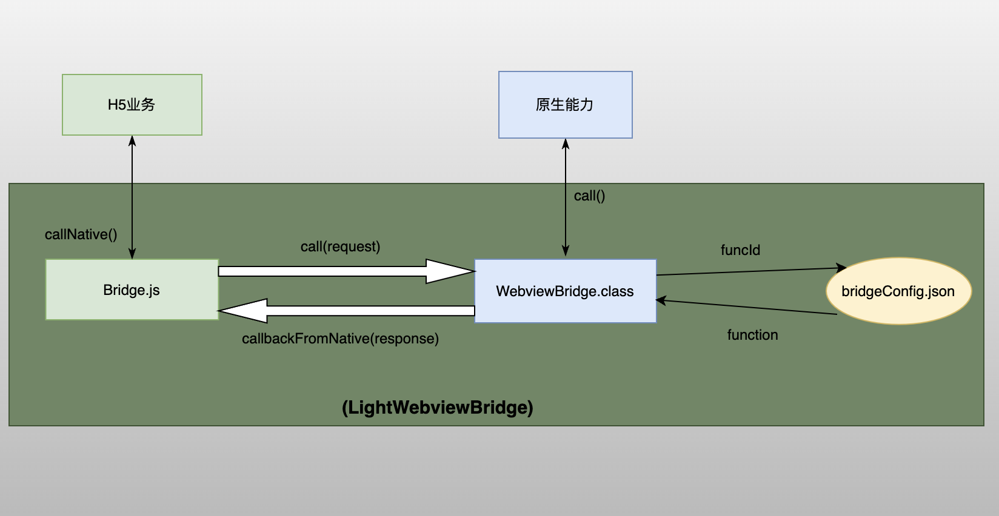

# 🌁LightWebviewBridge

`LightWebviewBridge`定位为一个轻量级、小而美的Hybrid混合APP解决方案工具，帮助开发者快速实现H5APP或内嵌H5界面功能，只聚焦于业务功能开发，而不用关注H5和Native的通信实现，便可快速相应业务功能，达到类似`小程序、公众号`的效果；

## 效果

Demo 场景:1.获取设备信息；2.创建二维码；3.扫码获取信息；4.打电话；......


## 原理

* 功能流程架构



## 使用

以创建二维码QR为例：

* index.html

```
    function createQr(){
        let data = document.getElementById("qrData").value
        callToNative("createQr",data,function (response) {
            document.getElementById("qrImg").src = "data:image/jpeg;base64," + response
        })
    }
```

H5通过callToNative("createQr",data,function (response){ ... })调用原生能力

* bridgeConfig.json

```
    "createQr": {
      "methodName": "createQr",
      "className": "com.rj.lightwebviewbridge.functions.Qr"
    }
```

配置，com.rj.lightwebviewbridge.functions.Qr.createQr 即 创建二维码的实现。

* Qr.kt

```
    fun createQr(data : String){
        val bitmap = CodeUtils.createQRCode(data,600)
        val bytes = ConvertUtils.bitmap2Bytes(bitmap)
        val base64 = EncodeUtils.base64Encode2String(bytes)
        callbackToJS(base64)
    }
```

原生功能执行,通过callbackToJS(base64)将结果数据返回给H5处理。

## 功能清单

* [x] H5与Native的通信及回调
* [x] 通信引擎统一标准化实现，无需重复实现jsinterface加载
* [ ] H5资源动态加载更新
* [ ] Demo UI优化
* [ ] 更多通用模块能力

## 其他：

* 请求体(Request)三要素:

  1.funcId(必填):功能唯一ID值，作为原生功能的映射，从bridgeConfig匹配

  2.data(选填):输入数据

  3.function(选填):原生功能执行后回调函数。

* bridgeConfig.json

​		H5调用Native能力的映射配置文件

## 后记

如果您喜欢LightWebviewBridge，或感觉帮助到了您，可以点右上角“Star”支持一下，您的支持就是我的动力，谢谢！
